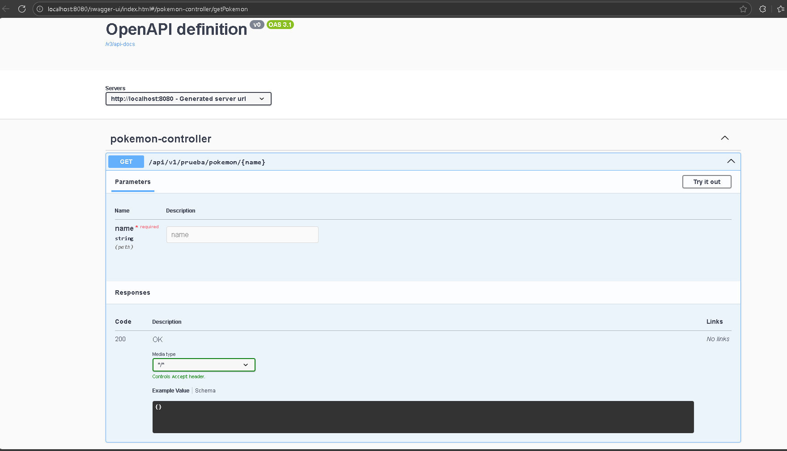
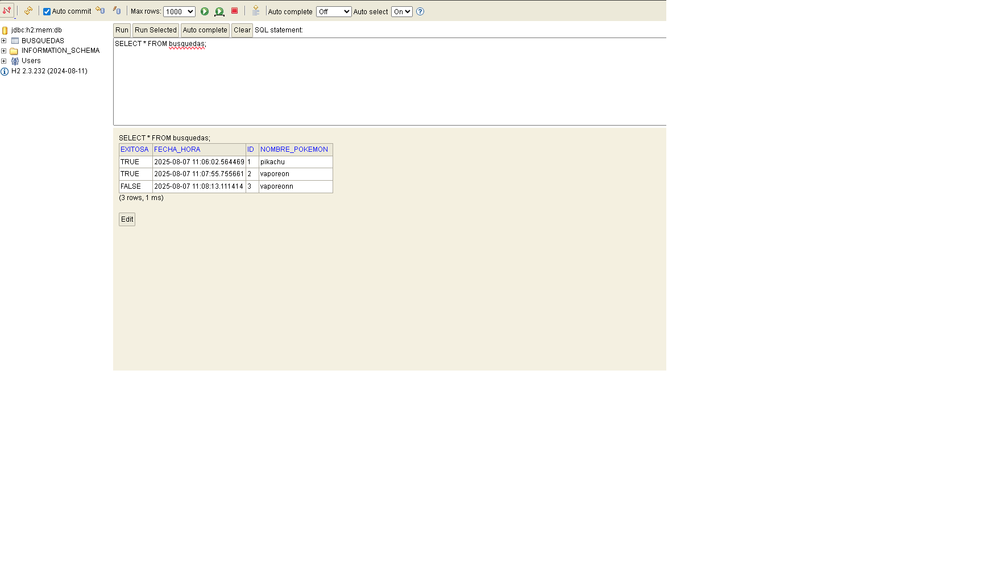
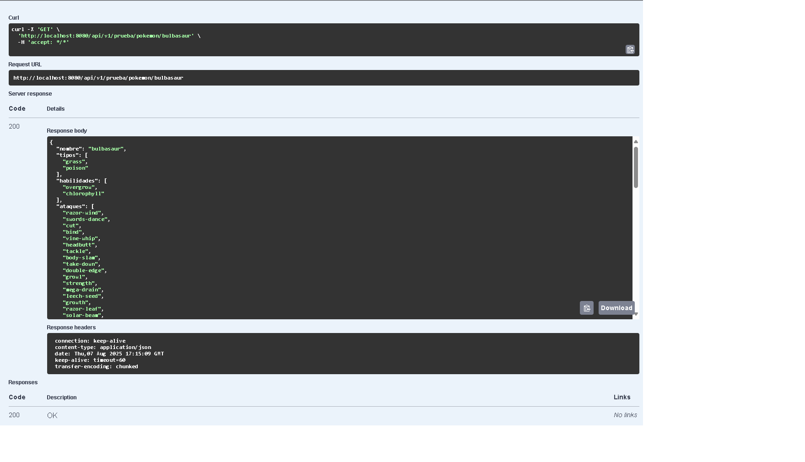

## PokemonAPI

API REST en Java 17 que consulta datos de Pokémon desde [PokeAPI](https://pokeapi.co/) y devuelve información simplificada en formato JSON. Además, guarda un historial de búsquedas en una base de datos H2 en memoria.

---

## Características

- Consulta datos de cualquier Pokémon desde `/pokemon/{nombre}`
- Devuelve información limpia: nombre, tipo(s), habilidades, ataques, estadísticas e imagen en base64
- Guarda historial de búsquedas en base de datos H2
- Documentación de la API con Swagger/OpenAPI
- Contenedor Docker listo para desplegar

---

## Tecnologías usadas

- Java 17
- Spring Boot 3
- H2 Database (en memoria)
- PokeAPI (API externa)
- Docker
- Maven
- JUnit & Mockito (para pruebas)

---

## Instalación y ejecución local

### Clona el proyecto

- bash/terminal
- git clone https://github.com/CristianARAMOS/PokemonAPI.git
- cd PokemonAPI

### Ejecutar con maven 
- mvn spring-boot:run

## Compilar y generar el contenerdor Docker
- mvn clean package 
- docker build -t pokemonapi:latest .
- docker run -p 8080:8080 pokemonapi:latest

## Para ingresar a Swagger

- http://localhost:8080/swagger-ui/index.html

## Para poder ingresar a H2 Console DB

-http://localhost:8080/h2-console
- Configuración
- JDBC URL: jdbc:h2:mem:db
- Usuario: admin
- Contraseña: (vacío)

## Ejemplo haciendo una solicitud con nombre pokemon = pikachu 

- GET http://localhost:8080/api/v1/prueba/pokemon/bulbasaur

